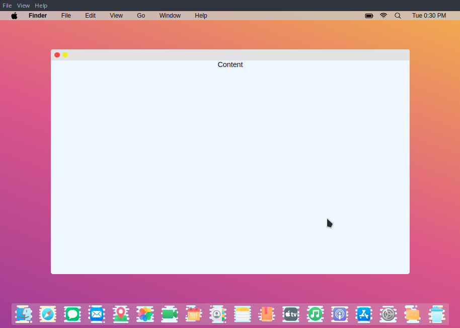

This is a clone of macOs, specifically a clone of the design of macOs, built from the electron-react boilerplate repo.

## Icon Attributions

- Dock Icons are all from Icons8.com
- Apple Icons are from Rob Janoff, Public domain, via Wikimedia Commons
- Other Menu Bar icons besides the apple icons are from heroicons

## Steps to run the project in development mode

```
npm install
npm run build
npm start
```

## Current View of Project

